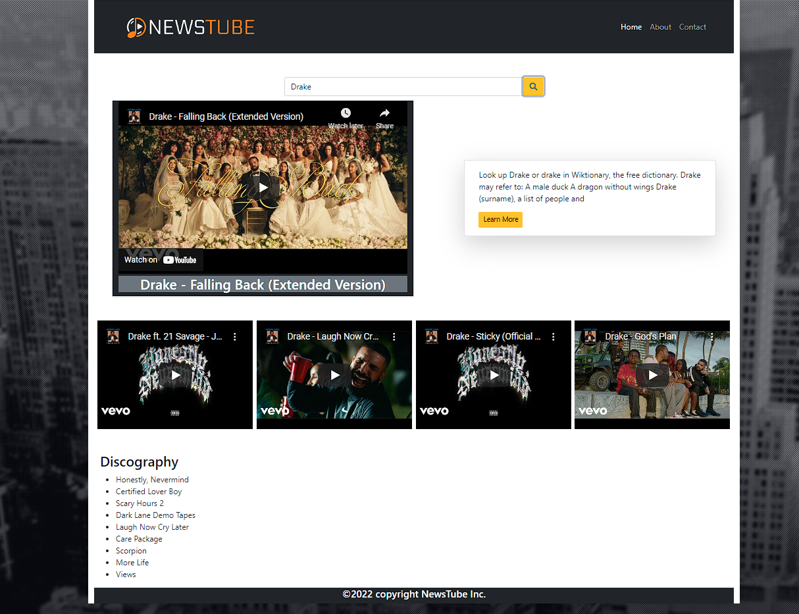

# Newstube

## To use the site: Type the name of the artist in the search field and click on the search button.

## Screenshot

## user story
    As a user
    I want to be able to search for a musician that I like
    So that I can see a video of one of their songs and see information about that musician.

## About & Features
    Live Link: (https://gavpo.github.io/artist-info/)
    When the search button is clicked then the user is presented with videos of the musician, the artist's discography is displayed, and information about the artist is displayed. 
    This information is gathered using youtube, wikipedia, and theaudiodb's API's. 
    Some initial challenges were how to find the necessary information from each API and how to set the proper parameters for the API. 
    In the future, some other features that could be implemented are a section to display concert or tour dates of the artist, or a page where merchandise of the artist could be purchased.

## Collaborators: 
     Gavin Orlich, Derek Kilgore, Grant Whitney, Gordon Richmeier.
     
### Licence: MIT License
    Copyright (c) [2022] [Newstube]
    Permission is hereby granted, free of charge, to any person obtaining a copy
    of this software and associated documentation files (the "Software"), to deal
    in the Software without restriction, including without limitation the rights
    to use, copy, modify, merge, publish, distribute, sublicense, and/or sell
    copies of the Software, and to permit persons to whom the Software is
    furnished to do so, subject to the following conditions:
    The above copyright notice and this permission notice shall be included in all
    copies or substantial portions of the Software.
    THE SOFTWARE IS PROVIDED "AS IS", WITHOUT WARRANTY OF ANY KIND, EXPRESS OR
    IMPLIED, INCLUDING BUT NOT LIMITED TO THE WARRANTIES OF MERCHANTABILITY,
    FITNESS FOR A PARTICULAR PURPOSE AND NONINFRINGEMENT. IN NO EVENT SHALL THE
    AUTHORS OR COPYRIGHT HOLDERS BE LIABLE FOR ANY CLAIM, DAMAGES OR OTHER
    LIABILITY, WHETHER IN AN ACTION OF CONTRACT, TORT OR OTHERWISE, ARISING FROM,
    OUT OF OR IN CONNECTION WITH THE SOFTWARE OR THE USE OR OTHER DEALINGS IN THE
    SOFTWARE.
